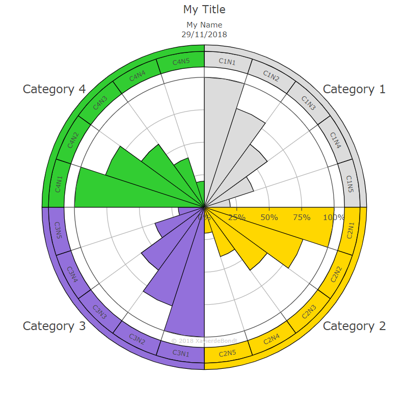

# Assesment Polarchart
Creation of the assesment polarchart using the `plot.ly` python library and `xlrd` to read from an excel file.    
An example of such a polarchart is given below


## Prerequisites
To use this project we expect the user to be using [python][py-home] with [xlrd][xlrd-home], [plotly][plotly-home] , [psutil][psutil-home] and [orca][orca-home] installed. For installation use     
```
$ pip install xlrd
$ pip install plotly
$ pip install psutil
```
For the installation of `orca` [click here!][orca-installguide] 

## Running the project
As a template we have included `template.xlsm` to show how the excel file should be built. To use this template with the program, rename it to `input.xlsm` and make sure it is in the same folder as `main.py`. The project can then be run by using
```
$ python main.py
```
## Using Pyinstaller
To use [pyinstaller][pyinstaller-home], we created a custom `template.spec` file that you can use in order to ensure that the `plotly`, `psutil` and `orca` libraries are includes in the dist folder. Ensure to edit the `template.spec` file so that the paths are valid.

[pyinstaller-home]:https://www.pyinstaller.org/
[py-home]:https://www.python.org/
[xlrd-home]:https://pypi.org/project/xlrd/
[plotly-home]:https://plot.ly/
[psutil-home]:https://pypi.org/project/psutil/
[orca-home]:https://plot.ly/python/orca-management/
[orca-installguide]:https://plot.ly/python/static-image-export/#install-dependencies

